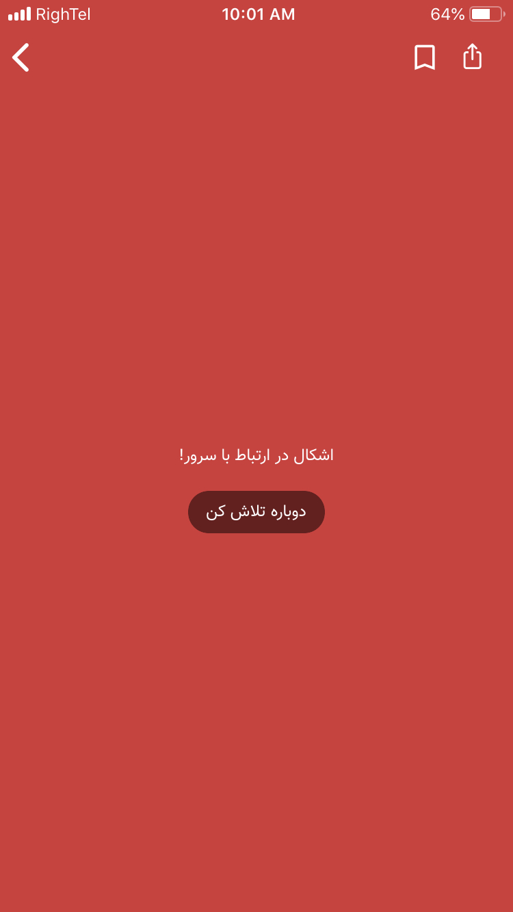
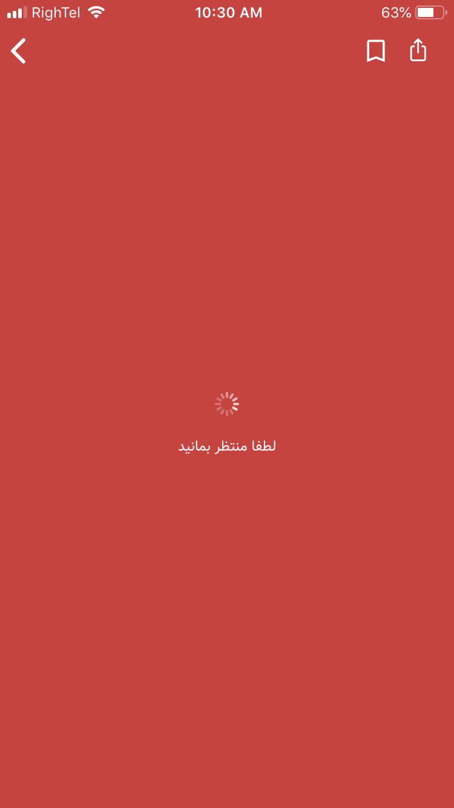

# UIViewController Messages Extension
## Introduction
this extension is little handy help when you are trying to make apps that works with API and servers, it’s support loading animation until get response from server, error messages, and so on

## To Do Options
- [x] Loading message
- [x] Error Messages
- [x] Error message with reload button
- [ ] Error message with custom icon

## Screen Shots

<p float="left">



</p>

## Methods
```swift
self.messageLoading(title: "please wait", with: UIColor.black, font: UIFont.systemFont(ofSize: 12), background: UIColor.white)
```

Message to present to user when the app is getting data from server.

```swift
self.messageError("cannot connect to server", with: UIColor.black, font: UIFont.systemFont(ofSize: 12), background: UIColor.white)
```

Message for when the connection breaks and you have no data to present.

```swift
self.messageHide()
```

If every thing was successful you can hide any type of message with this
